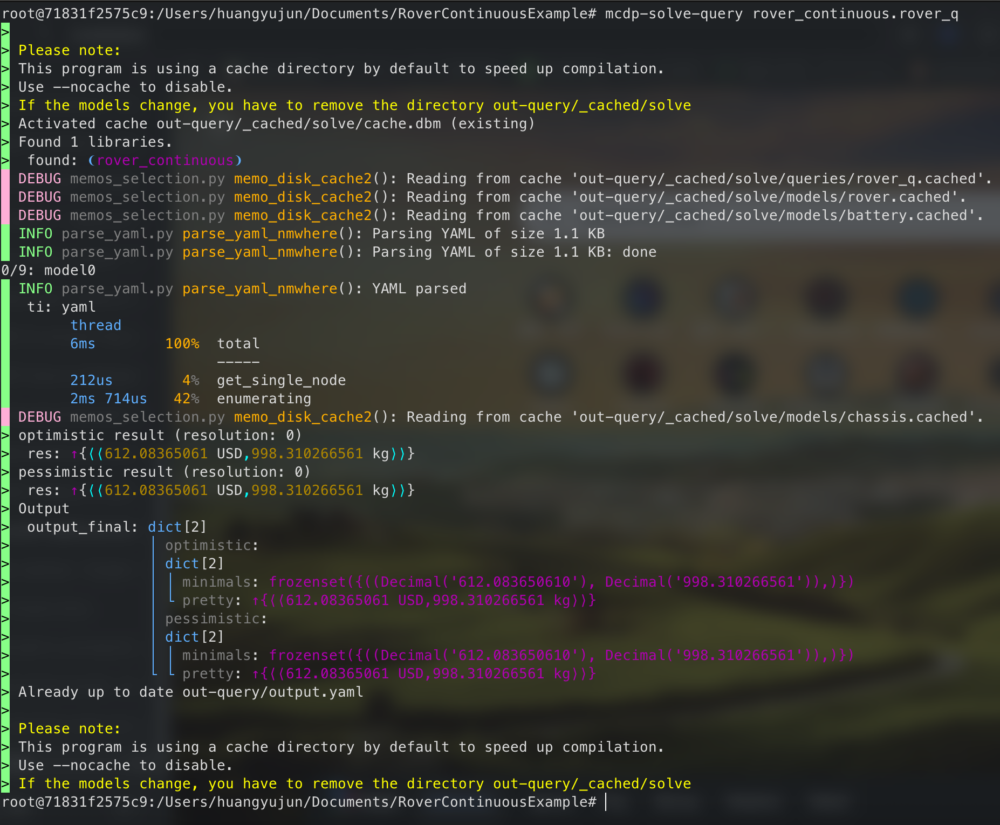

# Local Setup of MCDPL

## Installation Steps

### Install Docker Desktop

Follow the instructions on [https://docs.docker.com/desktop/].
Choose the corresponding operating system you are working with.

Test the installation by executing `docker --help` in the command line tool on your system.

If you wonder what is the command line tool of your system, check the APP "Terminal" on MacOS, and the application "PowerShell" if you use Windows.
Here is a gentle introduction to command-line tools: [https://developer.mozilla.org/en-US/docs/Learn_web_development/Getting_started/Environment_setup/Command_line].
You don't need to be proficient in command-line tools to use MCDPL, it's only required infrequently when you want to solve your co-design problem locally.

### Download the MCDP image

Execute the command `docker pull zupermind/mcdp:2025` in the command line tool.
Docker will download around 10GB of data to your computer.

### Test Your Installation and First Run of Solver

Navigate to a proper folder, and execute `git clone git@github.com:mit-zardini-lab/RoverContinuousExample.git`.
This command downloads this repo locally to your computer.

After it's complete, execute `cd RoverContinuousExample` to enter the downloaded folder.

In the command line, execute `docker run -it --rm -v $PWD:$PWD -w $PWD zupermind/mcdp:2025 bash`.
When you haven't downloaded the image, Docker will automatically do it for you.
You would see the prompt become something like the following:

It is like a virtual system running on your computer, with all the dependencies of MCDPL prepared.
And you can interact with this virtual system in this command-line session.

Execute the command `mcdp-solve-query rover_continuous.rover_q`.
You should see the following output:

## Known Issues

### End of Line (EOL) on different Operating Systems (OSs)

#### Description

On Mac and Linux, EOL is `\LF`; while on Windows, EOL is `\CRLF` by default.
Current docker image can only deal with EOL `\LF`, not `\CRLF`, and produces the following error, which is not human interpretable:

#### Proposed Actions

##### Documentation

We need to document this issue in the tutorials: [Computational Co-Design](https://storage.zuper.ai/sync/zupermind/mcdp-book/z7-prod/test/last/test-job/public.pdf)

##### Temporary: rely on IDE (Thanks to @Meshal Alharbi for the solution)

On some IDEs, for example VSCode, we can choose EOL manually for each file:

##### Good solution: set Docker Image/Every MCDP Repo to be robust

For Docker images, found this solution: [Docker for Windows: Dealing With Windows Line Endings](https://willi.am/blog/2016/08/11/docker-for-windows-dealing-with-windows-line-endings/)
But one needs to modify the image to test if it works.

For Repos, we can use `.gitattributes` file to force all files with EOL `\LF`. Reference: [https://docs.github.com/en/get-started/getting-started-with-git/configuring-git-to-handle-line-endings](https://docs.github.com/en/get-started/getting-started-with-git/configuring-git-to-handle-line-endings)
We can add it into the tutorials, too.
